# Mirage：Linux / Windows 桌面端设计方案

## 1. 项目概述

Mirage 是基于 Mira 构建的 Linux / Windows 桌面端产品，为 Mira 提供完整的 PC 运行环境、桌面交互能力与产品界面，使通用 Agent 能够进入用户真实的桌面工作环境执行任务。

Mirage 直接使用 Mira 提供的 Agent Harness Core，包括 Agent 运行、上下文、记忆、Tool/MCP、Workflow、Subagent、行为组织与相关 Agent 基础能力，并负责将这些能力与 Linux / Windows 本地环境连接起来。在视觉层面，Mirage 使用 Mirador 提供的轻量视觉基础设施，对桌面截图和局部图像执行 OCR、目标检测、几何结构分析、视觉 Cache 等处理。

因此 Mirage 的主要工作集中在三个方向：首先，为 Mira 提供统一的 Linux / Windows Desktop Environment，使 Agent 能够访问应用、窗口、Accessibility、屏幕、键鼠、文件、进程和系统能力；其次，将 Mira 与 Mirador 的能力整合为可以长期运行的桌面 Agent Runtime；最后提供面向用户的桌面产品，使用户能够创建任务、观察执行过程、使用 Workflow、管理 Agent，并在必要时介入 Agent 的执行。

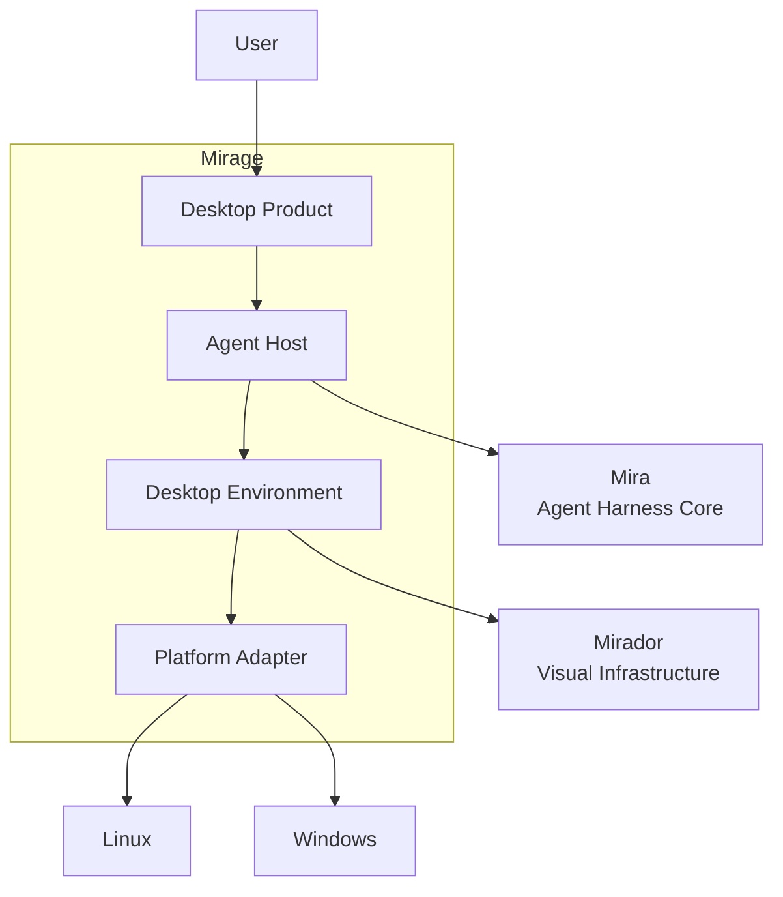

## 2. 需求背景

Mira 提供了构建和运行通用 Agent 所需要的核心能力，但通用 Agent 要真正进入 PC 环境，还需要一个能够连接 Agent Harness 与桌面操作系统的完整产品运行环境。

Linux 与 Windows 桌面中的任务具有高度混合的特征。一个任务可能首先读取文件，然后执行 Shell 命令，再启动某个桌面应用，通过 Accessibility 获取应用状态，必要时分析屏幕图像并执行键鼠操作。对于软件开发场景，Agent 可能主要工作在文件系统、终端和开发工具中；对于普通桌面任务，则可能更多依赖窗口、应用和 GUI；复杂任务通常同时使用这些能力。

因此 Mirage 首先需要解决的是 **PC 环境能力如何统一提供给 Mira**。窗口、应用、文件、进程、Accessibility、截图和输入在 Linux 与 Windows 上分别具有不同实现，如果这些平台细节直接进入 Agent 行为层，就会导致 Agent 和 Workflow 与具体操作系统强耦合。Mirage 需要在平台 API 与 Mira 之间建立稳定的 Desktop Environment 抽象。

第二个需求来自 **桌面视觉感知**。Accessibility 可以提供大量结构化 GUI 信息，但桌面环境中仍然存在自绘 UI、Canvas、游戏、远程桌面、图片内容以及 Accessibility 信息不完整的应用。Mirage 因此需要同时获取结构化桌面语义和视觉信息，并通过 Mirador 低成本地提取 OCR、目标、几何区域和缓存视觉特征，在必要时再向上层提供视觉语义。

第三个需求是 **Agent 的桌面产品化运行**。用户需要能够启动和管理 Mira Agent、提交任务、查看正在执行的行为、观察 Workflow 和 Subagent 的执行状态，并能够处理 Agent 发出的权限申请、确认请求和异常。长时间任务还要求 Agent Runtime 能够独立于主界面持续存在。

第四个需求是 **Linux 与 Windows 的统一产品体验**。两个平台的底层桌面系统差异明显，但对于用户和 Agent 来说，打开应用、读取窗口、操作控件、获取截图、输入文字等行为具有相同语义。因此 Mirage 需要将平台差异限制在 Backend 层，使绝大多数 Runtime、UI 和 Agent 行为能够跨平台共享。

Mirage 的整体需求因此可以归纳为：

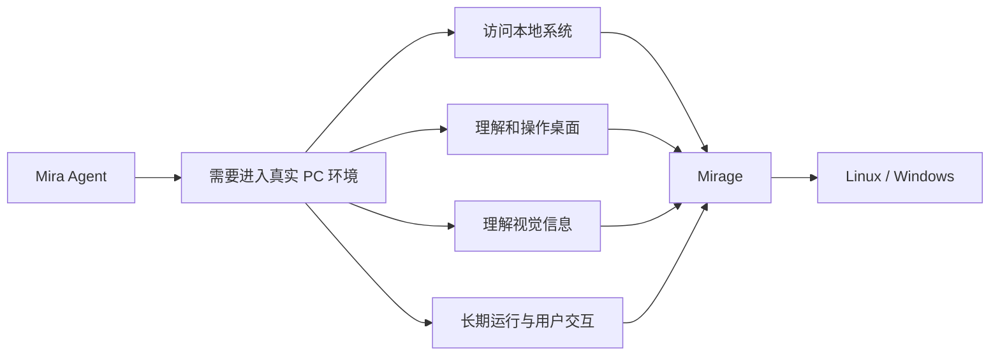

## 3. 设计目标

Mirage 的目标是在 Mira 与 Linux / Windows 之间建立完整的桌面 Agent 产品层。

从 Mira 的角度看，Mirage 应提供稳定的环境接口，使 Agent 可以获得当前桌面 Observation，并执行具有明确语义的 Desktop Action。Agent 不需要关注当前系统具体使用 UI Automation、AT-SPI2、X11、Wayland 或其他平台 API。

从视觉角度看，Mirage 应将屏幕和窗口图像转换为适合 Mirador 处理的输入，并将 Mirador 返回的 OCR、目标、几何区域和 Visual Cache Match 等结果组织进 Desktop Observation，使结构化桌面语义与视觉语义能够共同提供给 Agent。

从产品角度看，Mirage 应提供完整的 Agent Workspace，使用户可以运行 Mira Agent、提交任务、查看任务状态、观察 Agent 行为、使用和编辑 Workflow、查看 Subagent 调用关系，并处理 Agent 请求的人工确认。

整体执行链路为：

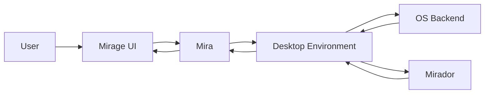

## 4. 总体架构

Mirage 本身主要由 Desktop Product、Runtime Integration、Desktop Environment 和 Platform Backend 四部分构成。

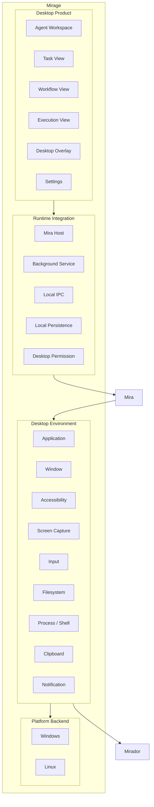

Mira Host 负责在 Mirage Runtime 中承载 Mira 实例以及建立 Mira 与 Desktop Environment 之间的连接。Agent 本身的 Harness 逻辑继续由 Mira 提供，Mirage 只负责宿主生命周期、桌面环境绑定、后台运行和产品层交互。

## 5. Desktop Environment

Desktop Environment 是 Mirage 最主要的基础设施模块。

它向 Mira 提供统一的 PC 环境能力：

```text
DesktopEnvironment
├── ApplicationProvider
├── WindowProvider
├── AccessibilityProvider
├── ScreenProvider
├── InputProvider
├── ClipboardProvider
├── FilesystemProvider
├── ProcessProvider
└── NotificationProvider
```

`ApplicationProvider` 负责应用发现、启动、关闭以及运行状态；`WindowProvider` 负责窗口枚举、前台窗口、焦点、位置和尺寸；`AccessibilityProvider` 提供当前应用的结构化 UI 信息；`ScreenProvider` 提供显示器、窗口和 ROI 图像；`InputProvider` 提供键盘、鼠标以及文本输入；`FilesystemProvider` 和 `ProcessProvider` 提供桌面 Agent 对本机工作环境的直接访问。

这些 Provider 形成统一的环境接口，上层行为不直接包含平台实现信息。

Provider 以访问器形式挂载在 `DesktopEnvironment` 上（`filesystem()` / `process()` 等，
返回空指针表示该环境不具备对应能力，消费方必须 fail closed）。M1 包含
FilesystemProvider（只读文本读取）与 ProcessProvider（有界 shell 执行）。
`M1-05`（[DEC-009](../decisions/DEC-009-provider-scope-budget-cancellation.md)）
为两者落地范围约束、执行预算与协作取消路径：Filesystem 读取强制 `PathScope`
读范围（空范围 fail closed）与字节预算（超限 fail closed，不静默截断）；
Process 执行在副作用前校验命令长度预算，并经 pinned-free 的 `CancelToken`
协作取消（运行时层将自己的停止令牌适配到它上面，整组进程收尾后返回
`cancelled` 结果）。Permission 判定（`RULE-05`）与用户确认挂点由 `M1-06`
落地为 runtime 层的 Permission Gate（`runtime/permission`，[DEC-010](../decisions/DEC-010-m1-permission-framework.md)）：
动作在进入 Provider 前按 Capability 策略判定（allow / confirm / deny），
Provider 自身保持 permission-agnostic，其硬边界不受判定结果影响。
[DEC-008](../decisions/DEC-008-m1-environment-binding-and-reference-providers.md)
记录了该过渡边界的演进。M1 参考后端是 `platform/linux::LinuxDesktopEnvironment`（实现
desktop 抽象接口；Adapter 依赖 Core 接口），完整 Linux / Windows Backend 分别在
M2 / M4 落地。

例如一个语义行为：

```text
activate(element_ref)
```

在 Windows 上可以最终转换为 UI Automation Pattern，在 Linux 上可以转换为 AT-SPI Action；如果目标来自视觉定位，则可以转换为对应位置的 Pointer Action。

这样 Mira 的 Workflow 和 Agent 行为可以尽可能保持平台无关。

## 6. Desktop Observation

Mirage 向 Mira 提供的桌面状态应表示为结构化 `DesktopObservation`。

一个 Observation 可以包含：

```text
DesktopObservation
├── ActiveApplication
├── ActiveWindow
├── WindowGeometry
├── SemanticSnapshot
├── VisualSnapshot
├── FocusState
├── PointerState
└── EnvironmentState
```

其中 Semantic Snapshot 来自 Accessibility，Visual Snapshot 则由 Mirage 与 Mirador 协同产生。

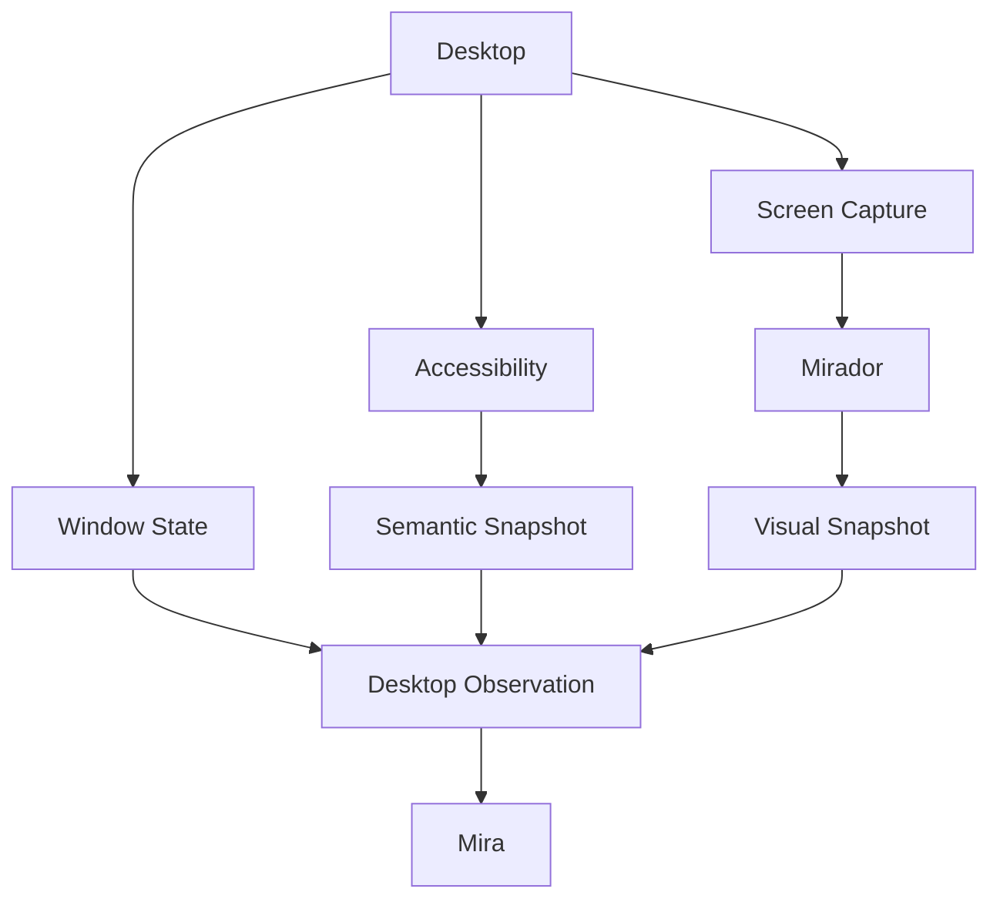

Mirage 可以根据当前任务按需生成 Observation。例如当前任务仅涉及终端和文件操作时，无需持续执行屏幕视觉分析；只有在 Agent 需要理解 GUI 时才获取对应窗口状态，在 Accessibility 信息不足时进一步启动视觉分析。

这种按需感知机制可以减少截图、OCR、目标检测和 VLM 带来的计算开销。

## 7. Accessibility 与 Semantic Snapshot

Accessibility 是 Mirage 理解标准桌面 GUI 的主要结构化数据来源。

Windows Backend 使用 UI Automation，Linux Backend 使用 AT-SPI2，将平台 Accessibility Tree 转换成统一节点结构。

Mirage 不直接将完整 Accessibility Tree 作为 Agent Observation，而是生成更紧凑的 Semantic Snapshot：

```text
Application: Visual Studio Code
Window: mira — Visual Studio Code

@e1 menu "File"
@e2 tree "Explorer"
@e3 treeitem "src"
@e4 editor "main.cpp" [focused]
@e5 button "Run"
```

每个当前可交互对象获得临时 Element Reference，例如 `@e5`。Mira 可以基于这些引用执行行为：

```text
activate(@e5)
input_text(@e4, "...")
```

Mirage 负责在行为真正执行时将 Element Reference 解析为对应平台对象。

Snapshot 可以根据窗口变化、Accessibility Event 和行为结果进行增量更新，从而避免每一步重新解析完整桌面状态。

## 8. Mirador 视觉感知集成

Mirador 作为 Mirage 的视觉基础设施，用于处理无法完全由 Accessibility 表达的桌面信息。

Mirage 负责 Screen/Window/ROI Capture，并根据任务需求调用 Mirador 的视觉能力。Mirador 可以提供 OCR、目标检测、线段与几何结构、视觉区域提取、图像特征以及 Visual Cache Match 等结果。

典型处理过程为：

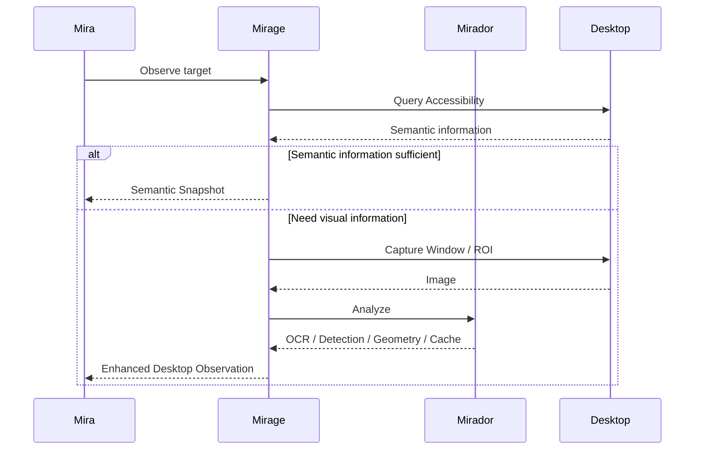

对于 Mirador 返回的视觉对象，Mirage 同样可以建立临时 Visual Reference：

```text
@v1 text "Start"
@v2 icon cache:settings
@v3 geometry closed-region
```

使 Agent 可以使用：

```text
click(@v2)
```

而由 Mirage 负责将 Visual Reference 转换为实际坐标和输入行为。

这样 Accessibility Element 与 Visual Element 在 Agent 层可以采用相似的引用机制。

## 9. 行为执行路径

桌面任务通常存在多种实现方式。Mirage 应向 Mira暴露当前环境可用的能力及其状态，让 Agent 能够选择适合当前任务的执行路径。

典型能力层次为：

```text
Tool / MCP
      ↓
Filesystem / Shell / Native Capability
      ↓
Accessibility
      ↓
Mirador Structured Vision
      ↓
Visual Localization + Input
```

例如读取配置文件可以直接访问 Filesystem；运行程序可以使用 Process Provider；标准桌面应用中的按钮可以通过 Accessibility 操作；Canvas、自绘应用或游戏中的对象则可以通过 Mirador 定位后执行 Pointer Action。

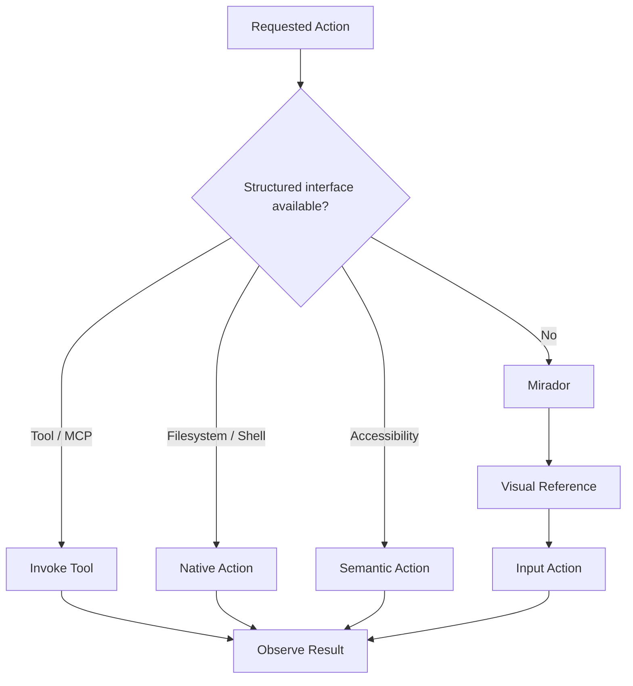

执行之后重新生成必要 Observation，由 Mira 判断任务是否继续。

## 10. Linux / Windows Platform Backend

Desktop Environment 通过 Platform Backend 屏蔽 Linux 与 Windows 的实现差异。

Windows 可以围绕 UI Automation、Win32、系统截图与输入 API 实现：

```text
WindowsBackend
├── UI Automation
├── Win32 Window / Process
├── Screen Capture
├── Keyboard / Pointer Input
├── Clipboard
└── System Integration
```

Linux Backend 则需要同时处理桌面 Accessibility 与显示服务器差异：

```text
LinuxBackend
├── AT-SPI2
├── X11 Backend
├── Wayland Backend
├── XDG Desktop Portal
├── Clipboard
└── System Integration
```

整体结构为：

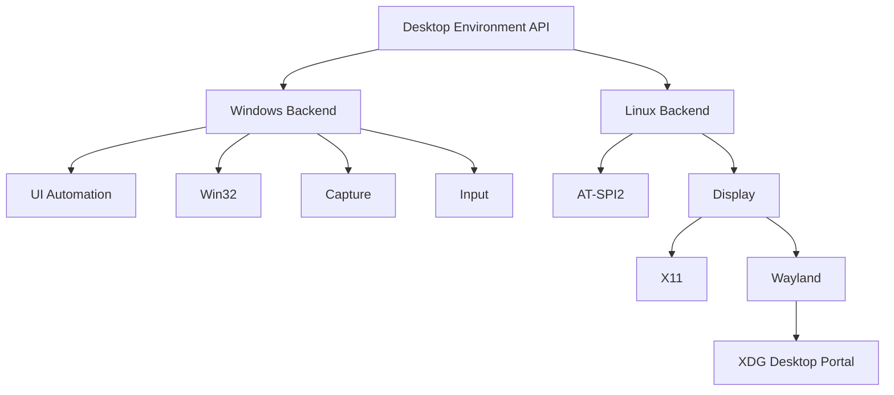

Backend 对上层返回统一数据结构，从而让 Desktop Observation、Element Reference 和 Desktop Action 在两个平台上保持一致语义。

## 11. Mira Runtime Integration

Mirage 需要提供一个稳定的 Mira Host，使 Mira 可以作为长期运行的 Agent Runtime 存在于桌面环境。

Mira Host 负责初始化 Mira、绑定 Desktop Environment、提供 Mirage 本地配置、连接 Tool/MCP 环境，并将 Mira 产生的任务状态和执行事件传递给 Mirage UI。

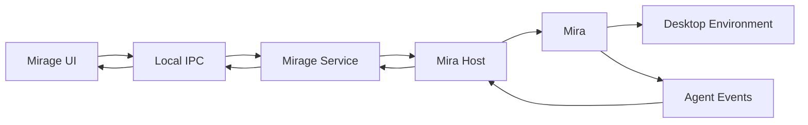

Mirage 不需要重新定义 Mira 内部的 Agent Harness 数据模型，而需要建立稳定的 Adapter，将 Mira 已有能力映射到桌面产品所需要的运行状态和 UI。

例如 Mira 提供的 Task、Workflow、Subagent、Tool Call 和 Trace 信息，可以通过 Runtime Integration 转换为 Mirage UI 可以订阅的事件。

### 11.1 Mira Host 生命周期与状态机（M1 冻结）

Mira Host（`runtime/mira_host`）是 pinned `MiraRuntime` 实例的唯一 owner：宿主负责按
顺序初始化（`initialize` → 绑定环境打开主会话 `open_session`）与关闭（`request_shutdown`
→ 等待排空 → `finish_shutdown`），不在 pinned 运行时之外另建并发设施。宿主状态集
自 M1 起冻结：

| HostStatus | 含义 | 后继状态 |
| --- | --- | --- |
| `Stopped` | 初始态与正常终态，未宿主 | `Starting` |
| `Starting` | `start()` 已接纳，pinned 初始化与会话打开进行中 | `Running`、`Failed` |
| `Running` | 已绑定环境，可提交任务 | `Stopping`、`Failed` |
| `Stopping` | `shutdown()` 已接纳，等待排空 | `Stopped`、`Failed` |
| `Failed` | 终态：初始化、绑定或运行失败 | （无，仅释放资源） |

约束：

- `Stopped` 与 `Failed` 是终态，幂等且不可复活；`start()`/`shutdown()` 在终态上只能
  失败关闭或重述已记录结果。关闭顺序必须闭合：任何成功初始化的 pinned 运行时实例，
  无论从 `shutdown()` 还是宿主析构离开，都经过 `request_shutdown → finish_shutdown`。
- 绑定接口为 `integration/mira` 的 `DesktopEnvironmentBinding`（不暴露 pinned 类型）；
  具体适配器的最终派生类型必须同时实现 pinned 环境契约，宿主在 `start()` 时以运行时
  cross-cast 恢复该契约，未携带契约的绑定按 `invalid_argument` 失败关闭。M1 的具体
  适配器是 `integration/mira::MiraEnvironmentBinding`：包装 `DesktopEnvironment`，
  pinned 感知/输入面按环境真实能力集如实适配（超集 fail closed、输入在任何副作用前
  拒绝、interrupt 幂等）；Filesystem / Process 经宿主操作面（`begin_operation` /
  `admit_operation_completion`）以 Mirage Provider 返回值暴露给宿主侧驱动循环
  （[DEC-008](../decisions/DEC-008-m1-environment-binding-and-reference-providers.md)）。
- 产品层可见的任务进度是 pinned `TaskState` 的 M1 投影：`Idle`；`Active`（Observing/
  Reasoning/Planning/Acting/Verifying/Recovering）；`Paused`（Pausing/Paused/
  TakeoverSettling/SuspendedForTakeover）；`Cancelling`；终态 `Completed`/`Failed`/
  `Cancelled`；`Unknown`（身份非法或不可表示）。终态幂等由 pinned 契约的转移表保证，
  迟到的完成或取消以可观察的拒绝呈现，不会复活终态任务。
- 单 owner 线程驱动宿主控制面（Runtime Service，见第 12 节）；`status()` 可被任意
  线程观察。pinned 运行时内部的 Executor 编队由 pinned 依赖自管，Mirage 以容量配置
  约束其准入与排队。

## 12. 后台运行

桌面 Agent 需要支持长时间任务，因此 Mirage Runtime 应独立于主窗口运行。

推荐采用：

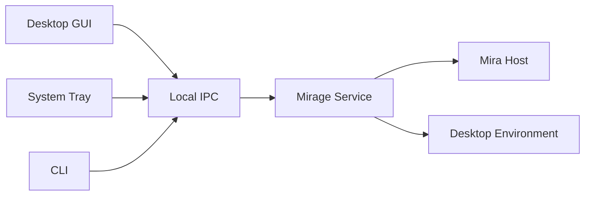

关闭主窗口后，已经运行的 Agent Task 可以继续执行。Tray 用于显示运行状态、暂停任务和快速进入 Mirage；CLI 则为开发者提供脚本化入口。

例如：

```text
mirage task list
mirage task inspect <id>
mirage task pause <id>
mirage workflow run <name>
mirage agent run <agent> "<goal>"
```

### 12.1 M1 落地形态（DEC-007）

M1 阶段 Local IPC 的落地形态由 [DEC-007](../decisions/DEC-007-local-ipc-and-runtime-service.md)
冻结：

- **传输**：Linux 使用 Unix domain socket（默认
  `$XDG_RUNTIME_DIR/mirage/mirage-service.sock`，回退 `/tmp/mirage-<uid>/`，目录
  `0700`）；Windows（M4）以命名管道实现同一契约。帧格式为 4 字节小端长度前缀 +
  UTF-8 JSON（pinned mira 的 JSON 模型实现，公共 API 保持 pinned-free），载荷上限
  1 MiB，单连接同时至多一个未决请求。
- **协议 v1 请求面**：`hello`、`task.submit`、`task.list`、`task.inspect`、
  `task.cancel`（`M1-05`，[DEC-009](../decisions/DEC-009-provider-scope-budget-cancellation.md)：
  中断在途桌面动作并按 pinned 取消语义结算任务，被中断步标记 `cancelled`）、
  `service.shutdown`。`task.submit` 携带 goal 与可选有序 steps（M1 桌面能力：
  `filesystem.read` / `process.execute`），由 Service 内的宿主侧驱动循环逐个执行、
  以 `begin_operation` / `admit_operation_completion` 括起进入 pinned 控制面并记录
  step 的 operation id（Trace 关联）；驱动循环在动作副作用前按 [DEC-010](../decisions/DEC-010-m1-permission-framework.md)
  的 Permission Gate 判定 Capability 策略，决策以 `permission` 字段记录进
  `task.inspect` 的 step 视图；这是无模型循环阶段的过渡形态，与 DEC-008 的
  迁移路径一致。
- **进程形态**：Runtime Service 由 `apps/service`（`mirage-service`）托管，前台运行
  至 `service.shutdown` 或 SIGINT/SIGTERM；`mirage service start` 经 fork + exec
  拉起兄弟二进制并等待就绪。GUI、Tray、CLI 只经 Local IPC 与之交互。
- **并发承载**：Service 进程内由 RuntimeService 持有唯一的 `executor::Executor`
  实例（`EXEC-01`）：IPC 事件循环为专属 blocking I/O worker，全部 MiraHost 操作经
  一个 SerialExecutionContext 串行化，任务驱动为可取消任务（step 间检查停止令牌），
  响应回投使用 `executor::comm::MpscChannel`。任务取消（`task.cancel` 与有序
  停机）按 desktop cancel token → 驱动停止令牌 → pinned cancel 的顺序传播，
  使在途桌面动作有界中断（`M1-05`，DEC-009）。

### 12.2 IPC 事件订阅（M1.5，DEC-012）

协议 v1 的事件推送面由 [DEC-012](../decisions/DEC-012-ipc-event-subscription-and-wire-schema.md)
定义、随 `M1.5-02` 落地冻结，wire 契约见[《Mirage Local IPC 协议 v1 Wire Schema》](mirage-ipc-protocol-v1.md)第 7 节：

- **订阅面**：`events.subscribe` / `events.unsubscribe`（无参数，订阅粒度为连接，
  断连即失效）；事件帧 `{"v":1,"seq":N,"event":"<名称>",...}`，`seq` 每连接自 1
  单调递增；hello 响应以 `events` 能力成员通告（新服务端恒写出，旧服务端缺席，
  客户端据此降级轮询）。订阅建立后服务端先下发当前 host 状态作为首个事件
  （seed，seq=1）。
- **M1.5 事件集**：`task.updated`（任务创建、步进与终态的快照，progress 与
  `task.inspect` 同源）、`host.status`（宿主五态变化）、`events.overflow`
  （连接级队列溢出的合成标记，`dropped` 计数）。事件是通知不是可靠投递，
  `task.list` / `task.inspect` 快照始终是事实源。
- **承载**：RuntimeService 持有 `executor::comm::Topic<EventPayload>` 作为多订阅
  广播点，host 状态以 `LatestMailbox` 语义（订阅 seed 取最新值）进入同一发布
  路径；每连接投递队列为订阅自带的 `MpscChannel`（有界、drop-oldest）。IPC
  循环每轮先写出响应帧、后写出事件帧（响应优先），溢出以 `events.overflow`
  显式呈现（`RULE-07`）；断连即销毁订阅并排空队列。任务发布点：任务创建
  （submit，serial 域）、取消受理（cancel，serial 域）、驱动步进与终态（驱动
  线程 best-effort 投递到 serial 域，拒绝或超时即丢弃该条通知）。

## 13. Agent Workspace

> **修订（2026-09-16，[DEC-013](../decisions/DEC-013-frontend-ia-harness-first.md)）**：
> UI 组织口径修订为 **harness 优先的统一壳**——会话（chat）是默认落地页，workflow
> 是一级导航中的平等入口；下文"采用 Agent Workspace 组织，而不是只围绕聊天历史
> 组织"的表述不再作为信息架构依据。本节描述的任务内组成（Conversation / 执行状态 /
> Workflow / Subagent / Tool Call / Trace）继续有效；页面级拓扑、风格规范与组件
> 规格以[《Mirage 前端设计规范与信息架构》](Mirage%20%E5%89%8D%E7%AB%AF%E8%AE%BE%E8%AE%A1%E8%A7%84%E8%8C%83%E4%B8%8E%E4%BF%A1%E6%81%AF%E6%9E%B6%E6%9E%84.md)为准。

Mirage 的桌面 UI 采用 Agent Workspace 组织，而不是只围绕聊天历史组织。

主要界面可以包括：

```text
Mirage
├── Agents
├── Tasks
├── Workspaces
├── Workflows
├── Tools / MCP
└── Settings
```

进入一个正在执行的任务后，可以查看 Conversation、当前执行状态、Workflow、Subagent、Tool Call 和 Trace。

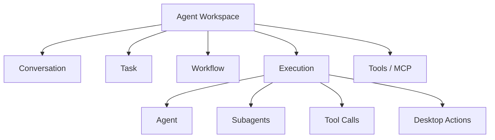

这些信息直接来自 Mira Runtime，Mirage 负责将其组织成适合桌面交互的产品界面。

Workflow 可以在桌面端获得完整的可视化编辑器，使用户查看节点、连接关系、参数和运行状态，并直接修改 Mira Workflow。

## 14. Desktop Overlay

当 Agent 正在执行桌面操作时，Mirage 可以提供轻量 Desktop Overlay。

Overlay 用于展示 Agent 当前关注的窗口或元素、即将执行的操作以及需要用户确认的行为。

例如当 Agent 通过 Accessibility 定位某个按钮时，可以在目标控件附近显示高亮；当视觉系统定位对象时，可以显示对应 Visual Region；当操作需要确认时，可以在当前工作位置直接显示确认入口。

```text
┌──────────────────────── Desktop ────────────────────────┐
│                                                         │
│        ┌───────────────────┐                            │
│        │      Save         │ ← Agent target             │
│        └───────────────────┘                            │
│                                                         │
│        Mirage: activating "Save"                        │
│                                                         │
└─────────────────────────────────────────────────────────┘
```

Overlay 同时可以用于调试 Desktop Observation，让开发者查看当前 Accessibility Element、Visual Reference 和 Agent 实际选择的目标。

## 15. 权限与桌面安全

Mirage 负责管理 Mira 对本机环境的实际访问权限。

权限按照桌面 Capability 组织，例如：

```text
desktop.observe
desktop.input
filesystem.read
filesystem.write
process.execute
clipboard.read
clipboard.write
application.launch
```

权限还应支持资源范围，例如允许某个 Agent 访问指定 Workspace，而不是整个用户目录。

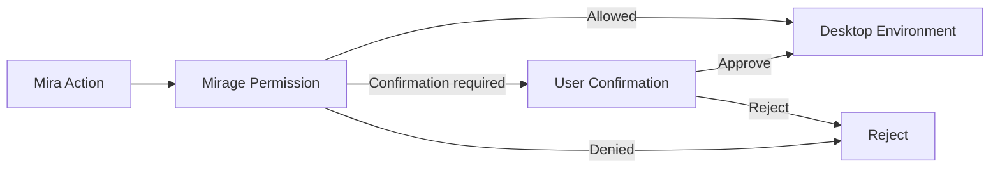

Mirage 将权限判断结果和用户确认结果返回 Mira，并将实际系统行为与 Agent Trace 关联，使用户能够追踪某一次文件修改、命令执行或桌面操作对应的 Agent 行为。

M1 阶段该判定以框架雏形落地（`M1-06`，
[DEC-010](../decisions/DEC-010-m1-permission-framework.md)）：`runtime/permission`
提供 pinned-free 的 Capability 词表（`filesystem.read` / `filesystem.write` /
`process.execute`）、每能力策略（`allow` / `confirm` / `deny`）与同步的用户
确认挂点（默认 fail closed；确认 UI 属 M5，届时演进为 Local IPC 异步确认面）。
Runtime Service 的任务驱动器在动作副作用前判定，决策记录进任务步
Trace；Provider 层的路径范围、预算与取消硬边界（DEC-009）不受判定结果影响、
始终生效。默认策略保持读取与执行放行、写入拒绝，收紧经显式配置。

## 16. 本地状态与持久化

Mirage 自身只持久化桌面产品运行需要的数据，例如本机配置、Workspace、窗口状态、平台权限、Runtime 状态和 UI 配置。

Agent Memory、Workflow 等由 Mira 定义和管理的数据继续通过 Mira 的接口访问。

Mirage 特有的持久状态可以包括：

```text
Mirage Local State
├── Application Settings
├── Workspace Bindings
├── Runtime Configuration
├── Desktop Permissions
├── Platform Configuration
├── MCP / Tool Connection Configuration
├── UI Layout
└── Runtime Recovery State
```

这种划分可以减少 Mirage 与 Mira 数据模型之间的重复。

### 16.1 M1 落地形态（DEC-011）

`M1-07` 落地上表中的两个条目，由 [DEC-011](../decisions/DEC-011-m1-local-state-persistence.md)
冻结文件布局与格式：

- **本地配置**（Application Settings / Runtime Configuration / Desktop
  Permissions 的 M1 可配置面）：`service.json`，位于
  `$XDG_CONFIG_HOME/mirage`（回退 `~/.config/mirage`）。内容为 IPC endpoint
  覆盖、Filesystem 读范围、逐能力 Permission 规则与确认挂点结果；M1 经
  `mirage-service --config` 显式加载，旗标逐项覆盖，服务不回写。
- **Runtime Recovery State**：`task-recovery.json`，位于
  `$XDG_STATE_HOME/mirage`（回退 `~/.local/state/mirage`）。记录已结算任务
  （终态、逐步状态、operation id、Permission 决策与结果摘要）；任务结算与有序
  停机时全量快照，服务启动时注水回注册表，使 `task list` / `task inspect` 跨
  重启可见。

两文件均为带 `schema` 版本号的 JSON 文档（当前 v1），编码复用 pinned mira 的
JSON 模型且只出现在 `runtime/persistence` 实现文件内，公共 API 保持
pinned-free；保存走"临时文件 + fsync + 原子重命名"，目录 `0700`、文件 `0600`，
并受明确字节预算约束（settings 64 KiB、recovery 4 MiB）。其余条目
（Workspace Bindings、UI Layout 等）随对应里程碑落地。

## 17. 推荐代码结构

Mirage 的仓库可以围绕产品集成与桌面能力组织：

```text
mirage/
├── apps/
│   ├── desktop/
│   ├── service/
│   ├── tray/
│   └── cli/
│
├── runtime/
│   ├── mira_host/
│   ├── service/
│   ├── ipc/
│   ├── persistence/
│   └── permission/
│
├── desktop/
│   ├── environment/
│   ├── application/
│   ├── window/
│   ├── accessibility/
│   ├── observation/
│   ├── capture/
│   ├── input/
│   ├── clipboard/
│   ├── filesystem/
│   └── process/
│
├── platform/
│   ├── windows/
│   │   ├── uia/
│   │   ├── win32/
│   │   ├── capture/
│   │   └── input/
│   │
│   └── linux/
│       ├── atspi/
│       ├── x11/
│       ├── wayland/
│       └── portal/
│
├── integration/
│   ├── mira/
│   ├── mirador/
│   └── mcp/
│
├── ui/
│   ├── workspace/
│   ├── tasks/
│   ├── workflow/
│   ├── execution/
│   ├── overlay/
│   └── settings/
│
└── tests/
```

其中 `runtime/mira_host` 和 `integration/mira` 负责 Mira 的宿主与接口适配；`integration/mirador` 负责视觉请求和结果转换；`desktop` 定义跨平台 Desktop Environment；`platform` 实现具体 OS Backend；`ui` 构成 Mirage 桌面产品。

`ui/` 的实现形态由 [DEC-006](../decisions/DEC-006-ui-web-frontend-packaging.md) 固定：采用 Web 前端技术栈（HTML / CSS / TypeScript），经嵌入式渲染壳（暂定 CEF，M3 冻结）承载为独立的桌面应用进程——界面渲染在应用自有窗口中，不是浏览器网页。GUI、Tray 与 CLI 一致，仅经 Local IPC 与 Runtime Service 交互，UI 不进入 C++ 目标依赖图，IPC 契约是两者唯一的耦合面。分发形态为 Linux `.deb` 与 Windows `exe` 安装包；更新通道暂定 Linux 走 apt 仓库、Windows 走签名应用内更新器（暂定默认值，M3 复核）。`ui/` 的信息架构、页面拓扑与风格规范由 [DEC-013](../decisions/DEC-013-frontend-ia-harness-first.md) 冻结，见[《Mirage 前端设计规范与信息架构》](Mirage%20%E5%89%8D%E7%AB%AF%E8%AE%BE%E8%AE%A1%E8%A7%84%E8%8C%83%E4%B8%8E%E4%BF%A1%E6%81%AF%E6%9E%B6%E6%9E%84.md)；上方目录树中的 `ui/` 视图目录是该规范的实现承载划分，`ui/workspace` 等占位目录与规范页面的映射在实现时于 `ui/README.md` 维护。

## 18. 开发路线

Mirage 第一阶段应首先建立基础产品骨架和 Mira Host，在 Linux 开发环境中能够启动 Mira Agent、提交任务，并允许 Agent 使用 Filesystem、Process/Shell 等基础 PC 能力。同时建立 Runtime Service 与 IPC，使 Agent 可以脱离 GUI 生命周期运行。

第二阶段完成 Desktop Environment 的核心接口，实现 Application、Window、Accessibility、Screen Capture 和 Input，并首先打通 Linux Backend。此阶段应完成 Semantic Snapshot、Element Reference 和基础 Desktop Observation，使 Mira 能够稳定操作标准桌面应用。

第三阶段接入 Mirador，将 OCR、目标检测、几何结构分析和 Visual Cache 等能力加入 Desktop Observation，形成 Accessibility 与视觉结合的桌面感知能力，并完成 Visual Reference。

第四阶段完成 Windows Backend，使同一套 Desktop Environment API、Observation 和 Action 能够在 Linux 与 Windows 上运行。

第五阶段完善 Agent Workspace、Workflow UI、Execution Trace、Subagent View、Desktop Overlay 和权限管理，使 Mira 已有 Agent Harness 能力在 Mirage 中获得完整桌面产品形态。

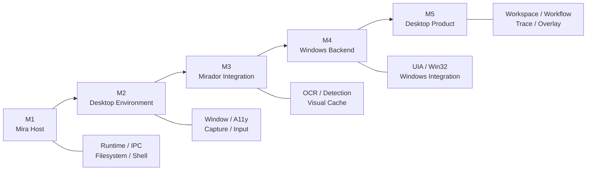

## 19. 总结

Mirage 要解决的问题，是将 Mira 已有的通用 Agent Harness 能力真正落入 Linux 与 Windows 的日常桌面环境，使 Agent 获得稳定的本机运行环境、桌面感知与操作能力，以及完整的桌面产品交互方式。

为实现这一目标，Mirage 以 Mira 作为 Agent Runtime 基础，以 Mirador 作为视觉基础设施，在自身内部重点建设 **Mira Host、Desktop Environment、Platform Backend、Background Runtime 和 Desktop Product**。

Desktop Environment 将文件、进程、应用、窗口、Accessibility、屏幕和输入等能力统一抽象，并通过 Linux / Windows Backend 实现平台适配；Mirador 负责将桌面视觉信息转换为 OCR、目标、几何结构和视觉 Cache 等低成本结构化信息；Mira Host 则将这些环境能力提供给 Mira，并把 Mira 的任务、Workflow、Subagent 和执行状态映射到 Mirage 产品界面。

最终的数据和控制关系可以概括为：

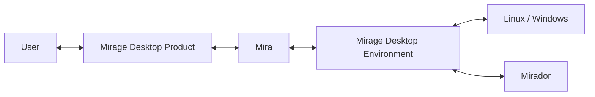

Mirage 由此成为 Mira 在 Linux / Windows 上的完整桌面宿主：用户通过 Mirage 使用通用 Agent Harness，Mira 负责 Agent 本身的运行与行为组织，Mirage 负责把这些行为连接到真实 PC 环境，而 Mirador负责为其中的视觉交互提供低负载视觉基础能力。